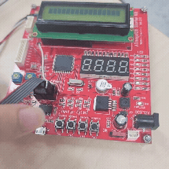

# MCU_0907 — 버튼으로 LED 패턴 바꾸기 (외부 인터럽트 실습)

ATmega128 교육용 보드에서 **SW2 버튼을 누를 때마다 LED 8개의 점멸 패턴이 순환**하도록 만드는 실습이다.
버튼 입력을 폴링(polling)이 아니라 **외부 인터럽트(INT4)** 로 처리하는 것이 핵심이며,
왜 인터럽트를 써야 하는지를 아래 "인터럽트 없이 하면 왜 안 되나" 절에서 설명한다.



---

## 1. 개발 환경 / 타깃

| 항목 | 값 |
|------|-----|
| MCU | ATmega128 (signature `0x1E9702`) |
| 클럭 | 외부 크리스털 14.7456 MHz (`F_CPU 14745600UL`) |
| 툴체인 | Atmel Studio 7 / `avr-gcc` (`MCU_0907.atsln`) |
| 빌드 산출물 | `MCU_0907/Debug/MCU_0907.hex` (git에는 미포함) |

빌드 후 `MCU_0907.hex` 를 ISP/부트로더로 보드에 굽는다.

---

## 2. 디렉터리 구성

```
MCU_0907/
├─ MCU_0907.atsln          # Atmel Studio 솔루션
└─ MCU_0907/
   ├─ main.c               # 패턴 3종 + INT4 ISR + 메인 루프
   ├─ d1PM/                # "day1 오후" 드라이버 모듈 모음
   │  ├─ board.h           # 핀 배치 한 곳에 정리 (하드웨어 추상화)
   │  ├─ led.c / led.h     # LED (PB0~PB7, Active-Low)
   │  ├─ btn.c / btn.h     # 버튼 (PE4~PE7, 누르면 0) + 폴링용 에지 검출
   │  ├─ fnd.c / fnd.h     # 7세그먼트 (PORTC + PD4~PD7, Common Anode)
   │  └─ buzzer.c / buzzer.h  # 부저 (PG3, 0=울림) — 이전 실습 잔재
   ├─ codes/
   │  └─ volatile_practice.c  # 레지스터를 주소로 직접 두드려 본 연습 코드
   └─ MCU_patterns.gif     # 동작 데모
```

---

## 3. 하드웨어 배선 (`d1PM/board.h`)

| 기능 | 포트 / 핀 | 논리 |
|------|-----------|------|
| LED D1~D8 | `PB0`~`PB7` | Active-Low (0 = 점등) |
| 버튼 SW2~SW5 | `PE4`~`PE7` | 누르면 `0` (외부 풀업 가정) |
| FND 세그먼트 | `PORTC` 전체 | Common Anode (0 = 켜짐) |
| FND 자리선택 | `PD4`~`PD7` | 1 = 해당 자리 ON |
| 부저 | `PG3` | 0 = 울림, 1 = 정지 |

이 실습에서 실제로 쓰는 건 **LED**와 **SW2(→ INT4)** 뿐이다.
FND는 `fnd_init()` 만 호출해 두었고 아직 표시 루프는 없다(4절 참고).

---

## 4. 동작 개요 (`main.c`)

### 패턴 3종

| `mode` | 함수 | 내용 |
|--------|------|------|
| 0 | `pattern_sequential()` | PB0 → PB7 순서로 하나씩 훑으며 점등 |
| 1 | `pattern_pingpong()` | 0→7 로 갔다가 7→0 으로 되돌아오는 왕복 |
| 2 | `pattern_alternate()` | `0x55` / `0xAA` 를 번갈아 써서 짝수/홀수 LED 교차 점멸 |

각 스텝은 `_delay_ms(200)` 으로 간격을 둔다.
그래서 패턴 한 바퀴에 `pattern_sequential` 은 약 1.6 초, `pattern_pingpong` 은 약 3 초가 걸린다.
**이 긴 delay가 뒤에서 설명할 "폴링이 안 먹히는" 이유의 핵심이다.**

### 버튼 → 패턴 전환

```c
volatile uint8_t mode = 0;          // ISR과 메인이 공유 → volatile 필수

ISR(INT4_vect){                     // SW2 하강 에지마다 자동 호출
    mode++;
    if (mode >= 3) mode = 0;        // 0 → 1 → 2 → 0 순환
}

int main(void){
    fnd_init();
    btn_init();
    led_init();

    EIMSK |= (1 << INT4);           // INT4 인터럽트 허용
    EICRB |= (1 << ISC41);          // ISC41:ISC40 = 10 → 하강 에지(누름)에서 트리거
    sei();                          // 전역 인터럽트 허용

    while (1) {
        switch (mode) {             // 현재 mode에 맞는 패턴을 계속 반복
            case 0: pattern_sequential(); break;
            case 1: pattern_pingpong();  break;
            case 2: pattern_alternate(); break;
        }
    }
}
```

- 메인 루프는 "지금 `mode` 에 해당하는 패턴을 무한 반복"만 한다.
- 버튼을 누르면 하드웨어가 알아서 `ISR(INT4_vect)` 로 점프해 `mode` 만 바꾼다.
- 다음 `switch` 차례에서 새 `mode` 가 반영되어 패턴이 바뀐다.

### 아직 안 된 것 (다음 단계)

`main.c` 안 주석 그대로 — FND와 LED 패턴을 **동시에** 돌리려면 `_delay_ms` 대신
**타이머 인터럽트**로 "LED 스텝 진행"과 "FND 자리 스캔"을 잘게 나눠 번갈아 해야 한다.
지금 구조는 `_delay_ms` 가 CPU를 통째로 붙잡고 있어서 FND 멀티플렉싱을 넣을 틈이 없다.

---

## 5. 인터럽트 없이 하면 왜 제대로 안 바뀌나

### 5-1. `_delay_ms` 는 CPU를 완전히 점유하는 바쁜 대기(busy-wait)

`_delay_ms(200)` 은 타이머를 쓰지 않는다. 정해진 횟수만큼 NOP를 도는 **빈 루프**다.
그 200 ms 동안 CPU는 오로지 카운트만 하며, 다른 코드를 한 줄도 실행하지 못한다.

패턴 함수는 이 delay로 가득 차 있으므로, 폴링 방식이라면 버튼을 확인할 수 있는 순간은
`_delay_ms` 와 `_delay_ms` **사이의 찰나뿐**이다.

```c
// 폴링 버전 (인터럽트 없음) — 잘 안 됨
while (1) {
    for (uint8_t n = 0; n < 8; n++) {
        led_on(n);
        _delay_ms(200);            // ← 이 200 ms 동안 버튼을 눌렀다 떼면 그대로 놓침
        led_off(n);
        if (btn_is_falling(BTN_SW2)) mode = (mode + 1) % 3;  // 아주 가끔만 검사됨
    }
    // ...
}
```

### 5-2. 그래서 생기는 증상

1. **짧게 누르면 씹힌다.** 사람이 버튼을 눌렀다 떼는 시간은 보통 50~150 ms.
   그 구간이 `_delay_ms(200)` 안에 들어가면 `btn_is_falling()` 이 호출될 때는 이미 버튼이 떨어진 뒤라
   "눌림"을 아예 못 본다. 꾹 눌러야 겨우 반응한다.
2. **반응이 굼뜨다.** 운 좋게 감지해도 최대 한 스텝(200 ms), 검사 위치에 따라 패턴 한 바퀴(수 초)까지 밀린다.
3. **패턴이 "덜컥" 끊긴다.** 패턴 중간에서 상태를 바꾸면 LED가 켜진 채로 다음 패턴으로 넘어가
   찌꺼기 불빛이 남는다.
4. **`_delay_ms` 사이사이에 `btn_is_falling()` 을 도배해야** 그나마 흉내라도 낸다 → 코드가 지저분해지고,
   그래도 delay 내부의 입력은 여전히 못 잡는다.

### 5-3. 외부 인터럽트(INT4)가 해결하는 것

- **하드웨어가 에지를 래치(latch)한다.** SW2를 누르는 순간 PE4에 하강 에지가 생기면,
  CPU가 `_delay_ms` 한복판에 있든 말든 `EIFR` 의 INT4 플래그가 셋된다.
  즉 **짧은 눌림도 하드웨어가 기억**했다가, delay가 끝나는 즉시(정확히는 그 명령 경계에서) ISR로 점프한다.
- **ISR은 아주 짧다.** `mode++` 한 번, 몇 마이크로초. 패턴 타이밍에 실질적 영향이 없다.
- **놓치지 않는다.** 눌림당 인터럽트 1회가 보장되므로 "씹힘"이 사라진다.
  (기계식 버튼이라 채터링으로 2번 셀 여지는 있음 → 다음 단계에서 디바운스로 보완)
- **메인 루프는 단순해진다.** 입력 검사 코드가 루프에서 사라지고, `switch(mode)` 만 남는다.

### 5-4. `volatile` 이 왜 필요한가

`mode` 는 **ISR이 쓰고 메인 루프가 읽는** 변수다.
컴파일러는 `while(1)` 루프만 보면 그 안에서 `mode` 를 바꾸는 코드가 없다고 판단하고,
`mode` 를 레지스터에 한 번만 읽어 캐싱한 뒤 계속 그 값을 재사용하도록 최적화할 수 있다.
그러면 ISR이 메모리의 `mode` 를 바꿔도 메인 루프는 **영원히 옛 값**만 본다 → 패턴이 안 바뀐다.

`volatile` 을 붙이면 "이 변수는 언제든 밖에서 바뀔 수 있으니 매번 메모리에서 다시 읽어라"는 뜻이 되어,
`switch(mode)` 가 루프를 돌 때마다 실제 최신 값을 가져온다.

> `codes/volatile_practice.c` 는 같은 개념을 레지스터 주소(`0x37`, `0x38`)에 직접 적용해 본 연습이다.
> `#define REG8(a) (*(volatile uint8_t *)(a))` — 주소를 "언제든 바뀔 수 있는 1바이트"로 해석해서 읽고 쓴다.

---

## 6. INT4 레지스터 설정 요약 (ATmega128)

| 레지스터 | 비트 | 이 코드의 설정 | 의미 |
|----------|------|----------------|------|
| `EIMSK`  | `INT4` | `1` | INT4 외부 인터럽트 개별 허용 |
| `EICRB`  | `ISC41:ISC40` | `1:0` | 하강 에지(버튼 누름)에서 트리거 |
| `SREG`   | `I` (`sei()`) | `1` | 전역 인터럽트 허용 |

- INT4~INT7 은 `EICRB`, INT0~INT3 은 `EICRA` 로 에지를 고른다.
- `ISC41=1, ISC40=0` → falling edge / `1,1` → rising edge / `0,1` → 양 에지.
- 이 코드는 `btn_init()` 에서 내부 풀업을 켜지 않으므로 **보드의 외부 풀업 저항**에 의존한다.

---

## 7. 빌드 & 실행

1. Atmel Studio 7 로 `MCU_0907.atsln` 열기
2. 타깃이 `ATmega128`, 클럭 `14745600` 인지 확인
3. `Build → Build Solution` → `MCU_0907/Debug/MCU_0907.hex` 생성
4. ISP(예: AVRISP mkII)나 부트로더로 굽기
5. 전원 인가 → LED가 `pattern_sequential` 로 흐름
6. **SW2** 를 누를 때마다 sequential → pingpong → alternate → sequential … 순환
